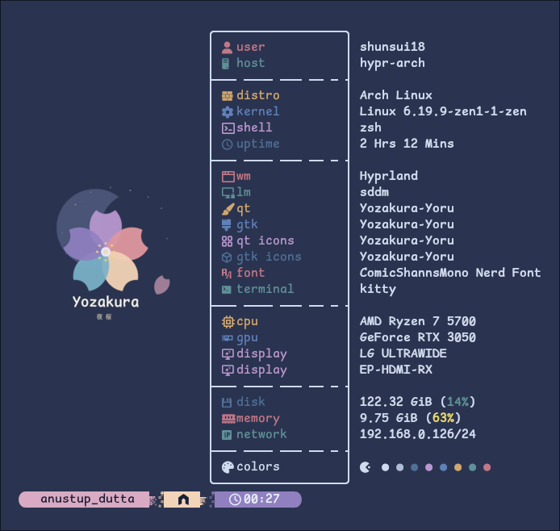
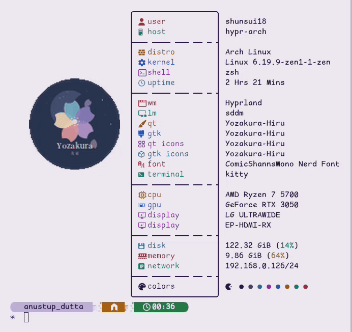

<div align="center">


# 夜桜 Yozakura — fastfetch Config

A handcrafted [fastfetch](https://github.com/fastfetch-cli/fastfetch) configuration styled with the [Yozakura](https://shunsui18.github.io/yozakura) palette — featuring an animated sakura GIF logo and a Yozakura-themed layout.

[](LICENSE)
[](https://github.com/fastfetch-cli/fastfetch)
[](install.sh)
[](https://github.com/shunsui18/yozakura)

</div>

---

## ✦ Preview

<table>
<tr>
<td align="center"><b>static</b></td>
<td align="center"><b>animated GIF logo</b></td>
</tr>
<tr>
<td></td>
<td></td>
</tr>
</table>

> **Note:** Animated GIF logo requires [Kitty Terminal](https://sw.kovidgoyal.net/kitty/) — the installer can set it up for you.

---

## ✦ Installation

### One-liner

```bash
bash <(curl -fsSL https://raw.githubusercontent.com/shunsui18/fastfetch/main/install.sh)
```

The installer will walk you through shell integration and Kitty Terminal setup:

```
  ╭─────────────────────────────────────────────╮
  │   🌸  fastfetch · Yozakura Installer  🌸   │
  ╰─────────────────────────────────────────────╯

  ▸ Preparing ~/.config/fastfetch
  ✓  Ensured /home/user/.config/fastfetch exists

  ▸ Installing config files & logos
  ✓  Copied file:      config.jsonc
  ✓  Copied directory: logos/

  ▸ Installing scripts
  ✓  Installed & made executable: scripts/fastfetch-logo-switcher.sh

  ▸ Shell integration
  ::  Detected shell config: /home/user/.zshrc
  ?   Add fastfetch + logo-switcher to /home/user/.zshrc? [y/N] _

  ▸ Kitty Terminal (GIF logo support)
  ?   Install Kitty Terminal for proper GIF logo support? [y/N] _
```

---

### Manual Installation

If you prefer to clone and run locally:

```bash
# 1. Clone the repo
git clone https://github.com/shunsui18/fastfetch.git && cd fastfetch

# 2. Run the installer
./install.sh
```

---

## ✦ What the Installer Does

1. **Self-locates** — resolves its own path regardless of where it is called from or whether it is symlinked
2. **Backs up** any existing `config.jsonc` to `config.jsonc.bak` before overwriting
3. **Copies** `config.jsonc` and the `logos/` directory into `$HOME/.config/fastfetch/`
4. **Installs** `fastfetch-logo-switcher.sh` into `$HOME/.config/fastfetch/scripts/` and makes it executable
5. **Shell integration** *(optional)* — appends `fastfetch` and the logo-switcher invocation to your shell RC file (`~/.zshrc`, `~/.bashrc`, etc.), skipping if already present
6. **Kitty Terminal** *(optional)* — detects whether `kitty-git` is already installed via the package manager, and offers to install it for proper GIF logo support; auto-detects your OS and package manager

> **GIF logos** require Kitty Terminal with GIF support. The `kitty-git` AUR package (or Homebrew HEAD build) is recommended; the stable `kitty` package may not render GIFs correctly.

---

## ✦ Logo Switcher

`fastfetch-logo-switcher.sh` rotates between the static PNG and animated GIF logo — falling back gracefully to the PNG if Kitty is not detected.

It is installed to `~/.config/fastfetch/scripts/` and optionally appended after the `fastfetch` call in your shell RC so it runs on every new shell session.

---

## ✦ File Structure

```
fastfetch/
├── assets/
│   ├── fastfetch-preview-1.png
│   └── fastfetch-preview-2.gif
├── logos/
│   ├── icon-transparent.png
│   └── yozakura-yoru-small.gif
├── scripts/
│   └── fastfetch-logo-switcher.sh
├── config.jsonc
├── install.sh
├── LICENSE
└── README.md
```

---

<div align="center">

crafted with 🌸 by [shunsui18](https://github.com/shunsui18)

</div>
